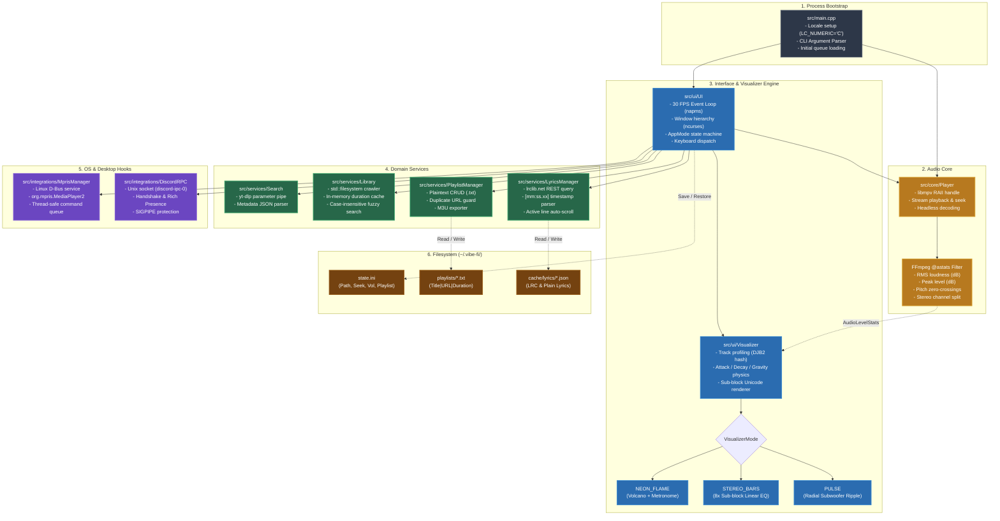
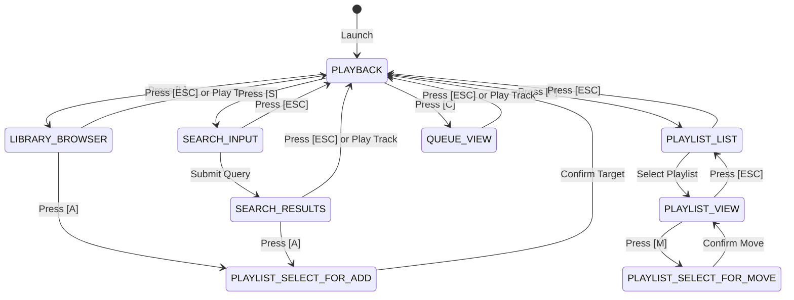

# AGENTS.md — AI Agent Guide & Codebase Mindmap

This document serves as the operational manual and mental model for AI coding agents (and human developers) working on **Vibe-Fi**. It outlines subsystem boundaries, data contracts, state machines, critical invariants, and implementation playbooks.

---

## 1. Quick Context & Mission

- **Project**: Vibe-Fi (Terminal music player for Linux & macOS)
- **Primary Languages**: C++17, CMake, Bash
- **Core Dependencies**: `libmpv` (Audio), `ncurses` (TUI), `yt-dlp` (Stream resolver), `dbus-1` (Linux media keys)
- **Build System**: CMake (>= 3.16)
- **Binary Targets**: `./build/vibe_fi` ➔ installed as `vibe` (`~/.local/bin/vibe` or `/usr/local/bin/vibe`)

---

## 2. Complete Architecture Mindmap



---

## 3. State Machine: `AppMode` Transitions

The UI operates as a finite state machine governed by `AppMode` (`src/ui/ui.hpp`):



---

## 4. Subsystem & File Map

| Path | Primary Class / Function | Purpose | Key Dependents |
| :--- | :--- | :--- | :--- |
| `src/main.cpp` | `main()`, `print_help()` | CLI bootstrap, locale setup, flag routing | `Player`, `UI` |
| `src/core/player.hpp / .cpp` | `Player` | `libmpv` RAII wrapper, `@astats` extraction | `UI`, `Visualizer` |
| `src/ui/visualizer.hpp / .cpp` | `Visualizer` | Physics calculations, spectrum rendering | `UI`, `Player` |
| `src/ui/ui.hpp / .cpp` | `UI` | Event loop, curses layouts, keyboard input | `main.cpp` |
| `src/services/library.hpp / .cpp` | `Library` | Local file crawler, format check, duration cache | `UI` |
| `src/services/lyrics.hpp / .cpp` | `LyricsManager` | `lrclib.net` REST client, sync parser | `UI` |
| `src/services/playlist_manager.hpp / .cpp` | `PlaylistManager` | Custom playlist CRUD, `.m3u` exporter | `UI` |
| `src/services/search.hpp / .cpp` | `search_youtube()` | Safe `yt-dlp` query pipeline | `UI`, `main.cpp` |
| `src/integrations/mpris.hpp / .cpp` | `MprisManager` | Linux D-Bus `org.mpris.MediaPlayer2` | `UI` |
| `src/integrations/discord_rpc.hpp / .cpp` | `DiscordRPC` | Native Unix domain socket IPC | `UI` |
| `src/utils/utils.hpp / .cpp` | `safe_stof()`, `find_executable()` | Utilities, path discovery, sanitization | All modules |

---

## 5. Critical Invariants & Rules (DO NOT BREAK)

### ⚠️ Invariant 1: Decimal Locale Requirement (`LC_NUMERIC="C"`)
`libmpv` relies internally on `strtod` for decimal parsing.
- **Rule**: Never remove or override `std::setlocale(LC_NUMERIC, "C");` in `main.cpp` or `Player::Player()`.
- **Failure Mode**: On European locales (e.g. Germany, France), `libmpv` fails to initialize or crashes on timestamp parsing.

### ⚠️ Invariant 2: `libmpv` Node Cleanup
When calling `mpv_get_property(mpv, "...", MPV_FORMAT_NODE, &node)`:
- **Rule**: Always pair with `mpv_free_node_contents(&node)`.
- **Failure Mode**: Significant memory leak (up to several MBs per minute) inside the 30 FPS audio extraction loop.

### ⚠️ Invariant 3: External Binary Execution Security
When invoking external binaries (`yt-dlp`, `ffmpeg`):
- **Rule**: Never concatenate unsanitized user query strings into `system()` or `popen()`. Always use sanitized pipes or argument vectors as implemented in `src/services/search.cpp`.

### ⚠️ Invariant 4: Curses Double-Buffering & Flicker Elimination
Terminal redrawing occurs 30 times per second.
- **Rule**: Never call `wrefresh(win)` or `refresh()` inside individual render routines. Call `werase(win)` -> draw -> `wnoutrefresh(win)`. Let the main loop invoke `doupdate()` **once** at the end of each frame.

### ⚠️ Invariant 5: Atomic Binary Replacement
When compiling and updating the local executable:
- **Rule**: Never use `cp build/vibe_fi ~/.local/bin/vibe` while `vibe` may be running in another terminal. Always use `install -m 755 ./build/vibe_fi ~/.local/bin/vibe` (which unlinks before writing, preventing `Text file busy` errors).

---

## 6. Implementation Playbooks for Agents

### Playbook A: Adding a New Visualizer Mode

1. **Update Enum**: Add identifier to `VisualizerMode` in `src/ui/visualizer.hpp`.
2. **Add State Vectors**: In `src/ui/visualizer.hpp`, add animation history vectors to `Visualizer` class if needed.
3. **Initialize & Clear**: In `src/ui/visualizer.cpp`, clear the vectors inside `Visualizer::reset()`.
4. **Implement Renderer**: Add `void Visualizer::render_your_mode(...)` in `src/ui/visualizer.cpp`.
5. **Dispatch**: Add a case branch inside `Visualizer::render()`.
6. **Cycle Logic**: In `src/ui/ui.cpp` (`UI::cycle_visualizer()`), update `vmode = (vmode + 1) % N;` and the status message.
7. **Documentation**: Update `README.md` and `print_help()` in `src/main.cpp`.

### Playbook B: Adding a New Keybinding

1. **Locate Target View**: Identify the relevant `AppMode` block in `UI::handle_input(int ch)` in `src/ui/ui.cpp`.
2. **Handle Keycode**: Add a `case 'X':` or `case KEY_...:` block.
3. **Keep Footer Updated**: If it affects general playback, update `UI::update_help()` in `src/ui/ui.cpp`.
4. **Documentation**: Update the markdown table in `README.md` and the CLI help in `src/main.cpp`.

### Playbook C: Adding Persistent Configuration

1. **Saving**: Add the property serialization in `UI::save_state()` in `src/ui/ui.cpp`.
2. **Loading**: Add property parsing in `UI::load_state()` in `src/ui/ui.cpp`.
3. **Format**: Follow the `key=value` format in `~/.vibe-fi/state.ini`.

---

## 7. Fast Build & Verification

```bash
# Configure & compile Release target
cmake -B build -DCMAKE_BUILD_TYPE=Release
cmake --build build -j$(nproc)

# Atomically install to user path
install -m 755 ./build/vibe_fi ~/.local/bin/vibe

# Verify executable
vibe --version
vibe --help
```
