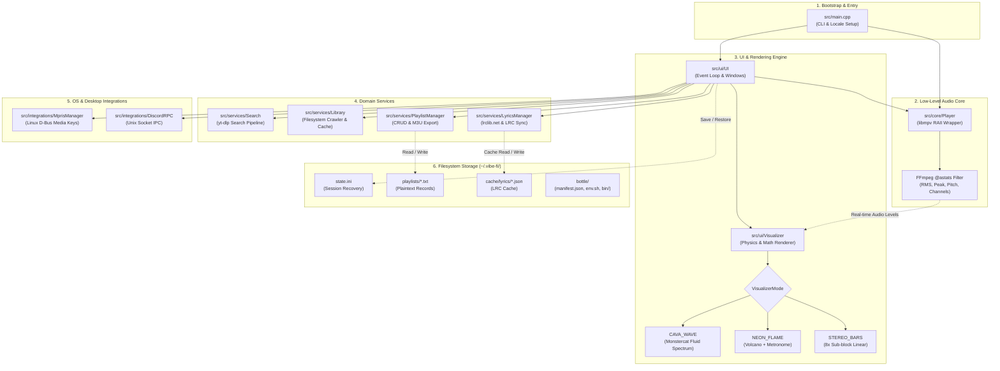

# Vibe-Fi System Architecture & Codebase Guide

This document provides a clear technical overview of Vibe-Fi — explaining how its subsystems work, how data flows through the application, and how code is structured.

> [!TIP]
> For the AI coding agent mental model, state transitions, and step-by-step playbooks, see [AGENTS.md](AGENTS.md).

---

## 1. System Overview & Core Principles

Vibe-Fi is a terminal-based music client for Linux and macOS built around five key principles:

1. **Fast and Lightweight**: Written in standard **C++17** and compiled with `-O2` optimizations. Memory usage stays under 35 MB during active streaming.
2. **Audio-Only Streaming**: Streams YouTube and remote audio through `libmpv` without downloading or decoding video, keeping CPU and network usage low.
3. **Smooth 30 FPS Interface**: Built with `ncurses` on a non-blocking render loop, keeping navigation responsive regardless of network or disk speed.
4. **Real Audio Visualizers**: Driven by live audio metrics from FFmpeg's `@astats` filter (measuring volume, peak hits, and frequency zero-crossings).
5. **Native Desktop Integration**: Linux media keys (MPRIS) and Discord Rich Presence connect directly using system D-Bus and Unix domain sockets — no Node.js scripts or extra daemons needed.

---

## 2. Directory Structure & Domain Separation

```
vibe-fi/
├── CMakeLists.txt              # CMake build configuration
├── install.sh                  # Multi-distro installer & dependency setup script
├── uninstall.sh                # Clean uninstaller script with dependency safety
├── README.md                   # User manual, hotkeys, and setup guide
├── ARCHITECTURE.md             # This document
│
└── src/
    ├── main.cpp                # Process bootstrap, locale setup, CLI argument parser
    │
    ├── core/                   # [Audio Engine]
    │   ├── player.hpp          # libmpv C++ RAII wrapper & AudioLevelStats schema
    │   └── player.cpp          # Playback controls, streaming reconnects, @astats hooks
    │
    ├── ui/                     # [Interface & Visuals]
    │   ├── visualizer.hpp      # Visualizer modes, physics models, and profile data
    │   ├── visualizer.cpp      # Ballistics calculations & Unicode block rendering
    │   ├── ui.hpp              # Window geometry, color themes, modal states (AppMode)
    │   └── ui.cpp              # ncurses event loop, keyboard dispatch, view drawing
    │
    ├── services/               # [Data Services & External APIs]
    │   ├── library.hpp / .cpp  # Local file crawler, duration cache, fuzzy search
    │   ├── lyrics.hpp / .cpp   # lrclib.net client, synced LRC parser, offline disk cache
    │   ├── playlist_manager.hpp# Plain text playlist CRUD and M3U exporter
    │   ├── playlist_manager.cpp
    │   ├── search.hpp / .cpp   # Secure yt-dlp search pipeline and metadata parsing
    │   └── updater.hpp / .cpp  # Background update checker and clean uninstaller
    │
    ├── integrations/           # [Desktop Integrations]
    │   ├── mpris.hpp / .cpp    # Linux D-Bus MPRIS (org.mpris.MediaPlayer2) media keys
    │   └── discord_rpc.hpp/.cpp# Native Unix socket Discord Rich Presence client
    │
    └── utils/                  # [Cross-Platform Utilities]
        ├── utils.hpp           # Path resolution, string sanitization, Bottle manifest
        └── utils.cpp           # Binary discovery, process pipes, formatting helpers
```

---

## 3. Subsystem Overview

### 3.1. Audio Engine (`src/core/Player`)

The `Player` class manages audio playback through `libmpv` using RAII:

- **Locale Setup**: Enforces `LC_NUMERIC="C"` so `libmpv` parses decimal timestamps consistently across all international locales.
- **Audio Analysis (`@astats`)**: Attaches an FFmpeg audio filter that measures overall loudness (RMS dB), peak volume, and stereo channel levels in 40 ms windows.
- **Network Resilience**:
  - Automatically reconnects on network interruptions (`reconnect=1`).
  - Pre-buffers up to 32 MB of audio in memory to prevent stuttering.
  - Automatically retries connection attempts on network timeouts.
- **Event Handling**: Dequeues `libmpv` playback events to distinguish natural track completion (`EOF`) from connection failures (`ERROR`), triggering automatic retries before pausing safely.

### 3.2. Visualizer Engine (`src/ui/Visualizer`)

Renders real-time audio visualizers inside the terminal at 30 FPS:

- **Visualizer Modes**:
  1. **`CAVA_WAVE`** *(Default)*: Fluid wave spectrum using neighbor smoothing and theme color gradients.
  2. **`NEON_FLAME`**: Mirrored equalizer columns with floating peak markers and a beat metronome indicator.
  3. **`STEREO_BARS`**: Classic linear equalizer with separate left and right channel bars.
- **Sub-Block Character Rendering**: Uses Unicode fractional block characters (` ` through `█`) to achieve 8x vertical resolution inside standard terminal cells.

### 3.3. Terminal User Interface (`src/ui/UI`)

Manages the interactive terminal interface and keyboard input:

- **State Machine (`AppMode`)**:
  - `PLAYBACK`: Main dashboard showing the visualizer, synced lyrics, and player status.
  - `LIBRARY_BROWSER`: File tree navigator for local music folders.
  - `SEARCH_INPUT` & `SEARCH_RESULTS`: YouTube search dialog and results browser.
  - `PLAYLIST_LIST` & `PLAYLIST_VIEW`: Playlist management and song viewer.
  - `QUEUE_VIEW`: Interactive upcoming play queue.
- **Color Themes**:
  - `Midnight` (Indigo / Cyan / Magenta)
  - `Matrix` (Emerald / Green)
  - `Nord` (Arctic Blue / Frost White)
  - `HyDE` (Velvet Magenta / Violet / Cyan)
- **Flicker-Free Rendering**: Uses curses double-buffering (`werase` + `wnoutrefresh` per window, with a single `doupdate` at the end of each frame).

### 3.4. Data Services (`src/services/`)

Handles external data, search, and storage:

- **`LyricsManager`**: Queries `lrclib.net` for time-synced `.lrc` lyrics, highlights the active line, and caches lyrics offline in `~/.vibe-fi/cache/lyrics/`.
- **`PlaylistManager`**: Saves and loads playlists as simple text files (`Title|URL|Duration`) under `~/.vibe-fi/playlists/`, with duplicate protection and `.m3u` export.
- **`Library`**: Scans local folders for supported audio files and caches track durations in memory.
- **`Search`**: Calls `yt-dlp` using secure argument vectors to prevent shell injection vulnerabilities.
- **`Updater`**: Checks for new GitHub releases once every 24 hours in the background and handles clean uninstallation.

### 3.5. Desktop Integrations (`src/integrations/`)

Integrates with system desktop services:

- **`MprisManager` (Linux)**: Registers the `org.mpris.MediaPlayer2.vibe_fi` D-Bus service, allowing hardware media keys and tools like `playerctl` to control playback.
- **`DiscordRPC`**: Connects directly to the Discord Unix domain socket (`discord-ipc-0`) to display the currently playing track and artist.

### 3.6. Dependency Isolation & Bottle System (`src/utils/`, `install.sh`, `uninstall.sh`)

Keeps the user's system clean and makes uninstallation effortless:

- **Isolated User-Space Binaries (`~/.vibe-fi/bottle/bin/`)**: Missing standalone tools (like `yt-dlp`) are installed in a local user folder without requiring root or `sudo`.
- **Priority Resolution**: `find_executable()` checks `$VIBE_BOTTLE_DIR/bin` and `~/.vibe-fi/bottle/bin` before checking system directories.
- **Manifest Tracking (`~/.vibe-fi/bottle/manifest.json`)**: Records active dependencies, bottled binaries, tracked system packages, and preinstalled host libraries.
- **Dependency Guard**: When uninstalling (`vibe --uninstall` or `uninstall.sh`), Vibe-Fi removes its bottle folder and checks if other applications need any installed packages before offering to remove them.

---

## 4. Execution Flow & Lifecycle

```
[User invokes: vibe]
        │
        ▼
main.cpp: setlocale(LC_ALL, ""); setlocale(LC_NUMERIC, "C");
        │
        ├── Checks flags (--help, --version, --update, --uninstall, --no-update)
        ├── Check cached update prompt (< 0.1ms disk read, 0ms network delay)
        ├── If CLI argument passed: loads URL, file, or search query into initial queue
        │
        ▼
Player::Player()
        ├── mpv_create()
        ├── Set headless options (vo=null, audio-display=no)
        ├── Attach @astats filter & resilient reconnect options
        └── mpv_initialize()
        │
        ▼
UI::UI()
        ├── initscr(), cbreak(), noecho(), nodelay(TRUE), keypad(TRUE)
        ├── load_themes(), load_saved_settings(), apply_theme() (restores last-used theme)
        ├── Start background D-Bus MPRIS thread (if Linux)
        ├── Connect Discord RPC socket
        └── Spawn start_background_update_check() thread (rate-limited to 24h)
        │
        ▼
UI::run() [Main Event Loop ~30 FPS]
        │
        ├── 1. Poll input: wgetch()
        │      └── Read keyboard or MPRIS command queue
        │      └── Dispatch to active AppMode handler
        │
        ├── 2. Poll audio engine:
        │      └── Check track progress, auto-play next track if song finished
        │      └── Read real-time @astats (RMS, Peak, Pitch)
        │
        ├── 3. Check background worker notifications:
        │      └── If update discovered: show status notice safely on UI thread
        │
        ├── 4. Update active view:
        │      ├── Visualizer::render() (Physics, attack/decay, Unicode bars)
        │      ├── LyricsManager auto-scroll tracking active timestamp
        │      └── View drawing (Library, Playlists, Queue)
        │
        ├── 5. Atomic render: doupdate()
        │
        └── 6. 33ms frame pacing: napms(30)
        │
[User presses ESC on playback screen]
        │
        ▼
confirm_quit() modal
        ├── "Wanna quit listening? [ YES ] [ NO ]"
        └── If YES: break loop; if NO: return to playback seamlessly
        │
        ▼
UI::save_state()
        ├── Write ~/.vibe-fi/state.ini (path, seek_pos, volume, playlist, theme, visualizer, update cache)
        └── End curses mode: endwin()
```

---

## 5. Storage Layout & Filesystem Contracts

All user configuration, state, and cache directories live under `~/.vibe-fi/`:

```
~/.vibe-fi/
│
├── state.ini                   # Session state ([R] recovery) & persistent preferences (theme, visualizer)
│   ├── path=https://...        # Last played URL or file path
│   ├── position=142.5          # Seek time in seconds
│   ├── volume=85               # Volume level (0-100)
│   ├── playlist=Chill          # Active playlist name (if applicable)
│   ├── title=Track Title       # Track title for instant lyrics recovery
│   ├── theme=Midnight          # Active theme (restored automatically on launch)
│   ├── visualizer=0            # Active visualizer index (restored automatically)
│   ├── available_update=v1.2.0 # Cached release tag discovered in background
│   └── last_update_check=...   # Unix timestamp of last GitHub check (24h rate limit)
│
├── playlists/                  # Plaintext playlist files
│   ├── Favorites.txt           # Records formatted as: Title|URL|Duration
│   └── Coding.txt
│
├── bottle/                     # Isolated runtime environment (Linux & macOS)
│   ├── manifest.json           # Tracked system packages, bottled binaries, preinstalled deps
│   ├── env.sh                  # Shell PATH & VIBE_BOTTLE_DIR export script
│   └── bin/                    # Isolated standalone binaries (e.g. yt-dlp)
│
└── cache/
    └── lyrics/                 # Cached API responses from lrclib.net
        └── Queen_Bohemian+Rhapsody.json
```

---

## 6. AI Agent Mental Model & Mindmap

The following Mermaid diagram maps the complete mental model of Vibe-Fi for AI coding assistants:



---

## 7. Developer & Contributor Guide

When contributing to or extending Vibe-Fi, keep these core rules in mind:

| Area | Guideline & Architecture Rule |
| :--- | :--- |
| **Locale & Timestamps** | Never remove or modify `std::setlocale(LC_NUMERIC, "C");` in `main.cpp` or `player.cpp`. `libmpv` requires standard decimal points to parse timestamps without crashing. |
| **Adding Visualizers** | Add the mode to `VisualizerMode` in `visualizer.hpp` and implement rendering in `visualizer.cpp`. Keep visualizer math separate from UI code. |
| **Changing Keybindings** | Update `UI::handle_input()` in `ui.cpp`, and update the tables in `README.md` and `main.cpp`. |
| **External Binaries** | Never use raw shell concatenation. Always use `find_executable()` and pass sanitized argument vectors as in `src/services/search.cpp`. |
| **Saving Settings** | Add new configuration keys in `UI::save_state()` and `UI::load_state()` in `ui.cpp`. |
| **Screen Redrawing** | Never call `refresh()` directly inside draw loops. Always use `werase(win)` &rarr; draw &rarr; `wnoutrefresh(win)` and let `UI::run()` call `doupdate()` once per frame. |
| **Bottle Dependencies** | Standalone tools must install to `~/.vibe-fi/bottle/bin/` without root. During uninstallation, always check reverse dependencies before removing system libraries. |
