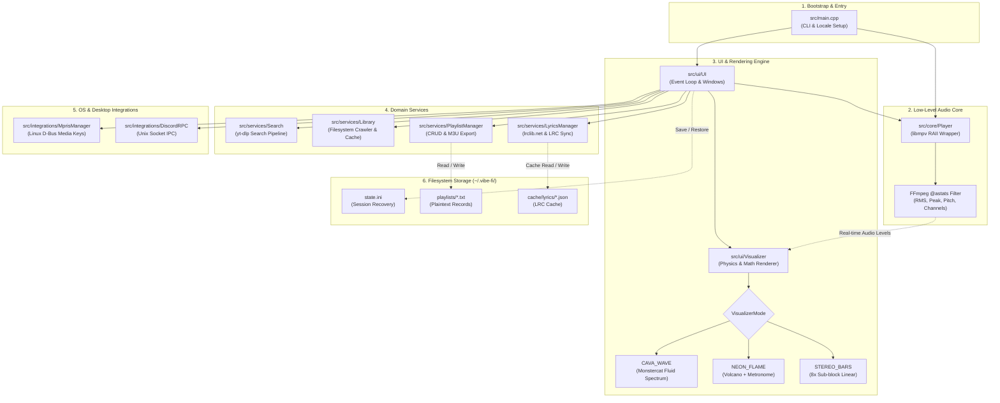

# Vibe-Fi System Architecture & Codebase Guide

This document provides an in-depth technical guide to the Vibe-Fi codebase, detailing its architectural layers, subsystems, execution lifecycles, and data flows.

> [!TIP]
> For the dedicated AI coding agent mental model, state machine transitions, and extension playbooks, see [AGENTS.md](AGENTS.md).

---

## 1. System Overview & Philosophy

Vibe-Fi is a terminal-based music client for Linux and macOS. It was engineered with specific non-negotiable constraints:

1. **Zero Electron/Browser Bloat**: Written in standard **C++17** compiled to native binary with `-O2` optimizations. Memory consumption typically stays below 25 MB during active streaming.
2. **Headless Audio Pipeline**: Streams YouTube and remote media through `libmpv` without downloading or decoding video packets, conserving CPU and network bandwidth.
3. **Decoupled 30 FPS Render Loop**: The ncurses interface runs on a non-blocking event loop decoupled from disk I/O and network requests.
4. **Audio-Driven Graphics**: Visualizers are not random noise generators; they are driven by real-time audio statistics (`@astats` libmpv filter) measuring RMS volume, peak transient hits, and zero-crossing pitch rates.
5. **No External IPC Daemons**: MPRIS and Discord Rich Presence communicate directly via native D-Bus (`dbus-1`) and raw Unix Domain Sockets (`AF_UNIX`) without requiring Node.js, Python sidecars, or proprietary SDKs.

---

## 2. Directory Structure & Domain Separation

```
vibe-fi/
├── CMakeLists.txt              # Modern target-based CMake build configuration
├── install.sh                  # Multi-distro automatic package & install script
├── uninstall.sh                # Interactive uninstaller script
├── README.md                   # User-facing manual & controls
├── ARCHITECTURE.md             # This document
│
└── src/
    ├── main.cpp                # Process bootstrap, locale configuration, CLI args
    │
    ├── core/                   # [DOMAIN: Low-Level Audio Engine]
    │   ├── player.hpp          # libmpv C++ RAII wrapper & AudioLevelStats schema
    │   └── player.cpp          # mpv property getters/setters, @astats filter hooks
    │
    ├── ui/                     # [DOMAIN: Interface & Visuals]
    │   ├── visualizer.hpp      # Visualizer modes, track profiling, physics states
    │   ├── visualizer.cpp      # Physics models (attack/decay/gravity) & sub-block rendering
    │   ├── ui.hpp              # Window geometry, color themes, modal states (AppMode)
    │   └── ui.cpp              # ncurses event loop, keyboard dispatch, view renderers
    │
    ├── services/               # [DOMAIN: Business Logic & External APIs]
    │   ├── library.hpp / .cpp  # Filesystem crawler, duration cache, fuzzy search
    │   ├── lyrics.hpp / .cpp   # lrclib.net REST queries, LRC parser, local disk cache
    │   ├── playlist_manager.hpp# Playlist CRUD, duplicate guard, M3U export
    │   ├── playlist_manager.cpp
    │   ├── search.hpp / .cpp   # Safe yt-dlp parameter pipeline & JSON extraction
    │   └── updater.hpp / .cpp  # Background update checker, cached prompt & uninstaller
    │
    ├── integrations/           # [DOMAIN: OS & Desktop Hooks]
    │   ├── mpris.hpp / .cpp    # Linux D-Bus MPRIS (org.mpris.MediaPlayer2) media keys
    │   └── discord_rpc.hpp/.cpp# Native Unix socket Discord IPC client
    │
    └── utils/                  # [DOMAIN: Cross-Platform Utilities]
        ├── utils.hpp           # Shell escaping, process pipes, safe_stof, safe_stoll, paths
        └── utils.cpp           # UTF-8 text sanitization, dynamic binary discovery
```

---

## 3. Subsystem Deep-Dive

### 3.1. Audio Core (`src/core/Player`)

The `Player` class encapsulates a single `mpv_handle*` with strict RAII ownership (non-copyable, movable).

- **Initialization**:
  - Sets `LC_NUMERIC="C"` globally before `mpv_create()`. `libmpv` uses `strtod` internally to parse time stamps and fractions; if the host system uses a comma decimal separator (e.g. `de_DE` or `fr_FR`), mpv crashes or misparses timestamps.
  - Attaches the `@astats` audio filter:
    ```cpp
    mpv_set_option_string(mpv, "af", "@astats:lavfi=[astats=metadata=1:reset=1:length=0.04]");
    ```
    This computes instantaneous audio metrics in 40ms intervals directly from the decoded PCM audio buffer.
- **Audio Metrics Extraction (`get_audio_stats`)**:
  - Reads `af-metadata/astats` node maps from `libmpv`.
  - Extracts:
    - `lavfi.astats.Overall.RMS_level` ➔ Perceived overall loudness in dB.
    - `lavfi.astats.Overall.Peak_level` ➔ Instantaneous peak hit in dB.
    - `lavfi.astats.1.RMS_level` & `2.RMS_level` ➔ Left and Right channel discrete levels.
- **Resilient Network Streaming & Buffering**:
  - `stream-lavf-o=reconnect=1,reconnect_streamed=1,reconnect_delay_max=5`: Seamlessly reconnects remote audio streams on transient TCP drops or packet loss.
  - `demuxer-max-bytes=32MiB` & `demuxer-readahead-secs=60`: Pre-buffers up to 32 MB (~25 minutes) of audio in memory to eliminate playback stutter.
  - `network-timeout=30` and `ytdl-raw-options`: Ensures 30-second connection headroom and 3 automated retries on extractor queries.
  - Modern browser User-Agent configuration to prevent HTTP 403 Forbidden errors from remote media CDNs.
- **Event Lifecycle Management (`poll_events`)**:
  - Non-blockingly dequeues libmpv events (`mpv_wait_event(mpv, 0)`) to maintain internal ring-buffer health.
  - Captures `MPV_EVENT_START_FILE`, `MPV_EVENT_FILE_LOADED`, and `MPV_EVENT_END_FILE`.
  - Accurately discriminates between `MPV_END_FILE_REASON_EOF` (natural song completion), `MPV_END_FILE_REASON_ERROR` (stream/decoding failure), and `MPV_END_FILE_REASON_STOP`.

### 3.2. Visualizer Engine (`src/ui/Visualizer`)

Visualizers run at 30 FPS inside the designated curses window.

- **Deterministic Track Profiling (`update_track_visual_profile`)**:
  - When a track loads, its title is hashed using the DJB2 algorithm.
  - Generates genre-adaptive parameters: `bpm` (74–160 BPM), `bass_weight`, `mid_weight`, `treble_weight`, and `rhythm_swing`.
- **Modes**:
  1. **`CAVA_WAVE`** *(Option 1)*:
     - Continuous fluid wave spectrum utilizing CAVA's Monstercat smoothing algorithm.
     - Asymmetric gravity ballistics with multi-tier dynamic theme gradients.
  2. **`NEON_FLAME`** *(Option 2)*:
     - Dual-mirrored volcano erupting from the center with dancing frequency columns.
     - Header integrates an active 4-beat rhythm metronome (`[♫ ● ○ ○ ○ ]` -> `[♫ ○ ● ○ ○ ]`).
     - Snappy attack and fast decay keep bars bouncing with luminous floating peak caps.
  3. **`STEREO_BARS`** *(Option 3)*:
     - Classic linear graphic equalizer spectrum.
     - Discrete stereo channel separation: left channels drive the left side, right channels drive the right side.
- **UTF-8 Fractional Sub-Block Rendering**:
  - Utilizes unicode block elements ` ` (1/8) to `█` (8/8) to achieve 8x vertical resolution inside terminal character cells.

### 3.3. Terminal User Interface (`src/ui/UI`)

- **State Machine (`AppMode`)**:
  - `PLAYBACK`: Main dashboard (Visualizer top, Synced Lyrics center, Navigation bottom).
  - `LIBRARY_BROWSER`: File tree navigator for local drives.
  - `SEARCH_INPUT` & `SEARCH_RESULTS`: YouTube search query and results browser.
  - `PLAYLIST_LIST` & `PLAYLIST_VIEW`: Custom playlist manager and song viewer.
  - `PLAYLIST_SELECT_FOR_ADD` & `PLAYLIST_SELECT_FOR_MOVE`: Modal dialogs to assign songs to playlists.
  - `QUEUE_VIEW`: Interactive upcoming playlist queue.
- **Color Themes**:
  - `Midnight`: Blue/Cyan/Magenta palette.
  - `Matrix`: Cyberpunk Emerald/Green/Lime palette.
  - `Nord`: Arctic Blue/Frost palette.
  - `HyDE`: Violet/Lavender/Cyan palette.
- **Autoplay Engine & Auto-Retry Recovery**:
  - Autoplay transitions strictly trigger on natural track completion (`consume_track_finished()` ➔ `EOF`).
  - Automatic Retry: When a stream error occurs (`consume_playback_error()`), Vibe-Fi automatically attempts up to 2 retries on the current track with clear status messages. If retries are exhausted, it pauses safely rather than cascading skips across the queue.
- **Window Hierarchy**:
  Uses ncurses sub-windows refreshed via `wnoutrefresh()` followed by a single atomic `doupdate()` per frame to eliminate terminal flicker.

### 3.4. Data Services (`src/services/`)

- **`LyricsManager`**:
  - Queries `https://lrclib.net/api/get` via parameterized `curl` calls.
  - Automatically parses synchronized `.lrc` timestamps (`[mm:ss.xx]`) into ordered vectors of `LyricLine`.
  - Disk cache: Serializes downloaded lyric sheets under `~/.vibe-fi/cache/lyrics/<Artist>_<Title>.json` for offline access.
- **`PlaylistManager`**:
  - Stores playlists under `~/.vibe-fi/playlists/<Name>.txt` formatted as pipe-delimited records:
    ```
    Title|URL|Duration
    ```
  - Includes duplicate URL prevention and one-click `.m3u` file exporter.
- **`Library`**:
  - Uses `std::filesystem::recursive_directory_iterator` with extension filtering.
  - Maintains an in-memory duration cache to prevent disk seek thrashing during scrolling.
- **`Search`**:
  - Invokes `yt-dlp` safely using `exec` argument vectors rather than shell string concatenation, preventing command injection vulnerabilities.
- **`Updater`**:
  - `check_and_prompt_cached_update()`: Reads cached release tags from `state.ini` on startup with 0ms network delay.
  - `start_background_update_check()`: Non-blocking worker thread querying GitHub Releases once per 24 hours while music is playing.
  - `handle_uninstall()`: Interactively and safely unlinks binaries and prompts for optional `~/.vibe-fi` purge.

### 3.5. Desktop Integrations (`src/integrations/`)

- **`MprisManager` (Linux only)**:
  - Registers the `org.mpris.MediaPlayer2.vibe_fi` D-Bus service.
  - Runs a background listener thread. When desktop media keys or `playerctl` send commands, they are placed onto a thread-safe FIFO command queue read by `UI::handle_input()`.
- **`DiscordRPC`**:
  - Connects to `/run/user/<UID>/discord-ipc-0` (or macOS `/tmp/discord-ipc-0`) via raw Unix Domain Sockets (`AF_UNIX`).
  - Implements the Discord IPC handshake (`opcode 0`) and activity update (`opcode 1`) with `SIGPIPE` protection.

---

## 4. Execution Flow & Lifecycle

```
[User invokes: vibe]
        │
        ▼
main.cpp: setlocale(LC_ALL, ""); setlocale(LC_NUMERIC, "C");
        │
        ├── Checks flags (--help, --version, --update, --uninstall, --no-update)
        ├── Check cached update prompt (< 0.1ms disk read, 0ms network delay)
        ├── If CLI argument passed: loads URL, file, or search query into initial queue
        │
        ▼
Player::Player()
        ├── mpv_create()
        ├── Set headless options (vo=null, audio-display=no)
        ├── Attach @astats filter & resilient reconnect options
        └── mpv_initialize()
        │
        ▼
UI::UI()
        ├── initscr(), cbreak(), noecho(), nodelay(TRUE), keypad(TRUE)
        ├── load_themes(), load_saved_settings(), apply_theme() (restores last-used theme)
        ├── Start background D-Bus MPRIS thread (if Linux)
        ├── Connect Discord RPC socket
        └── Spawn start_background_update_check() thread (rate-limited to 24h)
        │
        ▼
UI::run() [Main Event Loop ~30 FPS]
        │
        ├── 1. Poll input: wgetch()
        │      └── Read keyboard or MPRIS command queue
        │      └── Dispatch to active AppMode handler
        │
        ├── 2. Poll audio engine:
        │      └── Check track progress, auto-play next track if song finished
        │      └── Read real-time @astats (RMS, Peak, Pitch)
        │
        ├── 3. Check background worker notifications:
        │      └── If update discovered: show status notice safely on UI thread
        │
        ├── 4. Update active view:
        │      ├── Visualizer::render() (Physics, attack/decay, Unicode bars)
        │      ├── LyricsManager auto-scroll tracking active timestamp
        │      └── View drawing (Library, Playlists, Queue)
        │
        ├── 5. Atomic render: doupdate()
        │
        └── 6. 33ms frame pacing: napms(30)
        │
[User presses ESC on playback screen]
        │
        ▼
confirm_quit() modal
        ├── "Wanna quit listening? [ YES ] [ NO ]"
        └── If YES: break loop; if NO: return to playback seamlessly
        │
        ▼
UI::save_state()
        ├── Write ~/.vibe-fi/state.ini (path, seek_pos, volume, playlist, theme, visualizer, update cache)
        └── End curses mode: endwin()
```

---

## 5. Storage Layout & Filesystem Contracts

All user configuration, state, and cache directories live under `~/.vibe-fi/`:

```
~/.vibe-fi/
│
├── state.ini                   # Session state ([R] recovery) & persistent preferences (theme, visualizer)
│   ├── path=https://...        # Last played URL or file path
│   ├── position=142.5          # Seek time in seconds
│   ├── volume=85               # Volume level (0-100)
│   ├── playlist=Chill          # Active playlist name (if applicable)
│   ├── title=Track Title       # Track title for instant lyrics recovery
│   ├── theme=Midnight          # Active theme (restored automatically on launch)
│   ├── visualizer=0            # Active visualizer index (restored automatically)
│   ├── available_update=v1.2.0 # Cached release tag discovered in background
│   └── last_update_check=...   # Unix timestamp of last GitHub check (24h rate limit)
│
├── playlists/                  # Plaintext playlist files
│   ├── Favorites.txt           # Records formatted as: Title|URL|Duration
│   └── Coding.txt
│
└── cache/
    └── lyrics/                 # Cached API responses from lrclib.net
        └── Queen_Bohemian+Rhapsody.json
```

---

## 6. AI Agent Mental Model & Mindmap

The following Mermaid diagram maps the complete mental model of Vibe-Fi for AI coding assistants:



---

## 7. Developer & Agent Cheat Sheet

When modifying or extending Vibe-Fi, keep these critical invariants in mind:

| Scenario | Rules & Invariants |
| :--- | :--- |
| **Modifying Audio Filters** | Do NOT touch `setlocale(LC_NUMERIC, "C")` in `Player::Player()` and `main.cpp`. Removing or altering this breaks decimal parsing in `libmpv` and causes fatal crashes. |
| **Adding a New Visualizer** | Add an entry to `VisualizerMode` in `src/ui/visualizer.hpp`. Implement its rendering function in `src/ui/visualizer.cpp`. Do NOT add visualizer math to `ui.cpp`. |
| **Modifying Keybindings** | Update `UI::handle_input()` in `src/ui/ui.cpp`. Always maintain parity in `README.md` and `print_help()` in `main.cpp`. |
| **Calling External Binaries** | Never use raw `system()` or unsanitized shell concatenation. Always use `find_executable()` and pass sanitized, escaped argument vectors as seen in `src/services/search.cpp`. |
| **State Persistence** | When adding a new persistent configuration key, add reading/writing logic to `UI::save_state()` and `UI::load_state()` in `src/ui/ui.cpp`. |
| **Terminal Drawing** | Never call `refresh()` on individual windows inside inner loops. Always use `werase(win)` -> draw -> `wnoutrefresh(win)` and let the main loop call `doupdate()` once at the end of the frame. |
