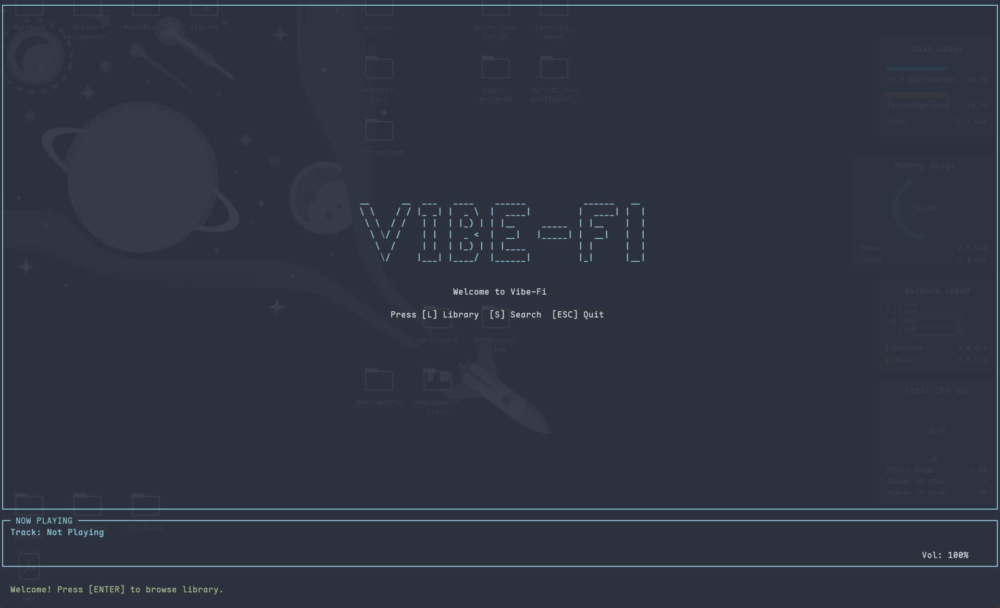
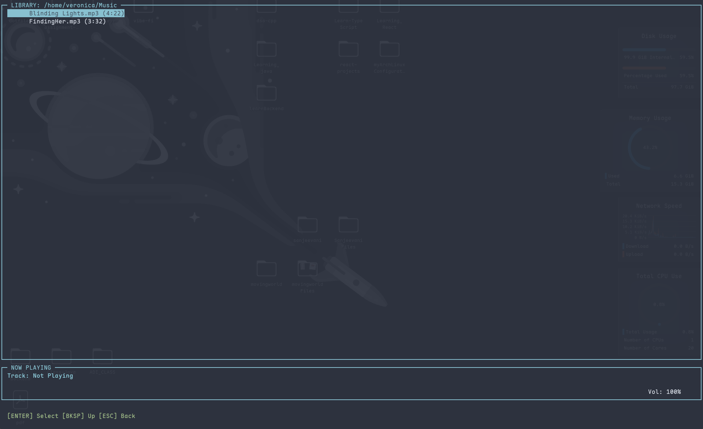
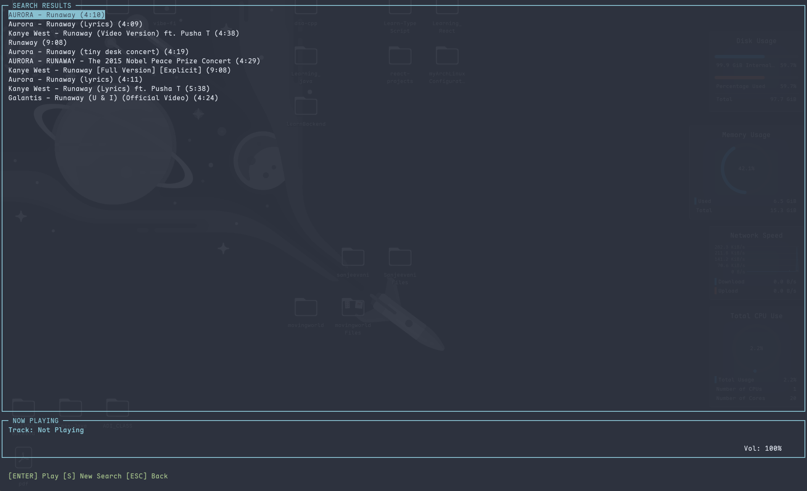
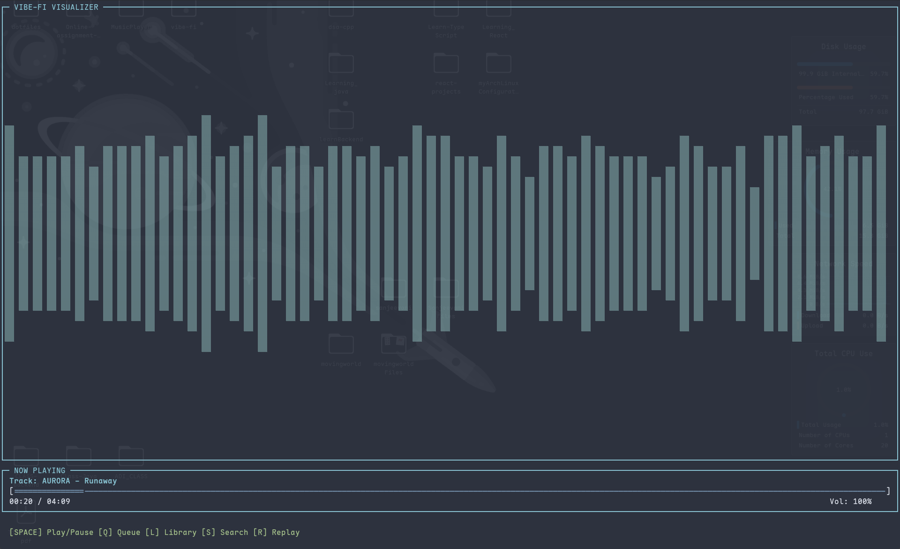

# Vibe-Fi 🎵

A beautiful terminal-based music player with YouTube search, local library browsing, and a retro visualizer.

---

## 📸 UI Preview


### **Intro Screen**



### **Library Browser**



### **YouTube Search Results**



### **Playback + Visualizer**



---

## ✨ Features

- **Modern TUI Design** – Clean interface with borders, colors, and smooth navigation
- **YouTube Integration** – Search and play music directly from YouTube
- **Local Library** – Browse and play your local music collection
- **Live Visualizer** – Animated audio visualizer bars
- **Queue Management** – Navigate between search results and playback
- **Replay Function** – Quickly replay the last played track
- **Intuitive Controls** – Keyboard-driven interface

---

## 🚀 Installation

### Automatic Installation (Recommended)

The install script automatically detects your OS and installs all dependencies:

```bash
git clone https://github.com/Swadesh-c0de/vibe-fi.git
cd vibe-fi
chmod +x install.sh
./install.sh
```

**Supported Systems:**

- ✅ Arch Linux (and derivatives)
- ✅ Ubuntu/Debian (and derivatives)
- ✅ macOS (requires Homebrew)

---

## 📦 Manual Installation

### Dependencies

- **Build tools:** `cmake`, `make`, `g++`
- **Libraries:** `libmpv-dev`, `libncurses-dev`
- **Runtime:** `mpv`, `yt-dlp`, `ffmpeg`

### Arch Linux

```bash
sudo pacman -S base-devel cmake mpv ncurses yt-dlp ffmpeg
```

### Ubuntu/Debian

```bash
sudo apt install build-essential cmake libmpv-dev libncurses-dev mpv ffmpeg
# Install yt-dlp
sudo wget https://github.com/yt-dlp/yt-dlp/releases/latest/download/yt-dlp -O /usr/local/bin/yt-dlp
sudo chmod a+rx /usr/local/bin/yt-dlp
```

### macOS

```bash
brew install cmake mpv ncurses yt-dlp ffmpeg pkg-config
```

### Build

```bash
mkdir build && cd build
cmake ..
make
sudo cp vibe_fi /usr/local/bin/vibe
```

---

## 🎧 Usage

```bash
vibe
```

The app starts with an intro screen. From there:

---

## ⌨️ Controls

### **Global**

- **ESC** — Quit application
- **Arrow Keys** — Navigate lists

### **Intro Screen**

- **L** — Go to Library
- **S** — Search YouTube
- **Q** — Quit

### **Playback Mode**

- **SPACE** — Play/Pause
- **Q** — Return to search results queue
- **L** — Go to Library
- **S** — New search
- **R** — Replay last track
- **←/→** — Seek backward/forward (5s)
- **+/-** — Volume up/down

### **Library Browser**

- **ENTER** — Play file or enter directory
- **BACKSPACE** — Go up one directory
- **ESC** — Back to playback

### **Search**

- **Type** — Enter search query
- **ENTER** — Execute search
- **ESC** — Cancel

### **Search Results**

- **ENTER** — Play selected track
- **S** — Start new search
- **ESC** — Back to playback

---

## 🔍 Features in Detail

### **YouTube Search**

- Search songs, artists, or playlists
- Shows title + duration
- Up to 10 results

### **Local Library**

- Scans your `~/Music` directory
- Supports: MP3, WAV, FLAC, M4A, OGG
- Directory navigation + durations

### **Visualizer**

- Real-time animated bars
- Reacts to audio
- Auto-hides when idle

---

## 🛠️ Troubleshooting

### **"Failed to extract stream URL"**

Some YouTube videos may be restricted. Try another.

### **No audio output**

Check mpv:

```bash
mpv --version
```

### **yt-dlp not found**

Update it:

```bash
sudo yt-dlp -U
```

---

## 📄 License

MIT License — See LICENSE

---

## 🙌 Credits

- **mpv** — Media player
- **ncurses** — Terminal UI
- **yt-dlp** — YouTube downloader

