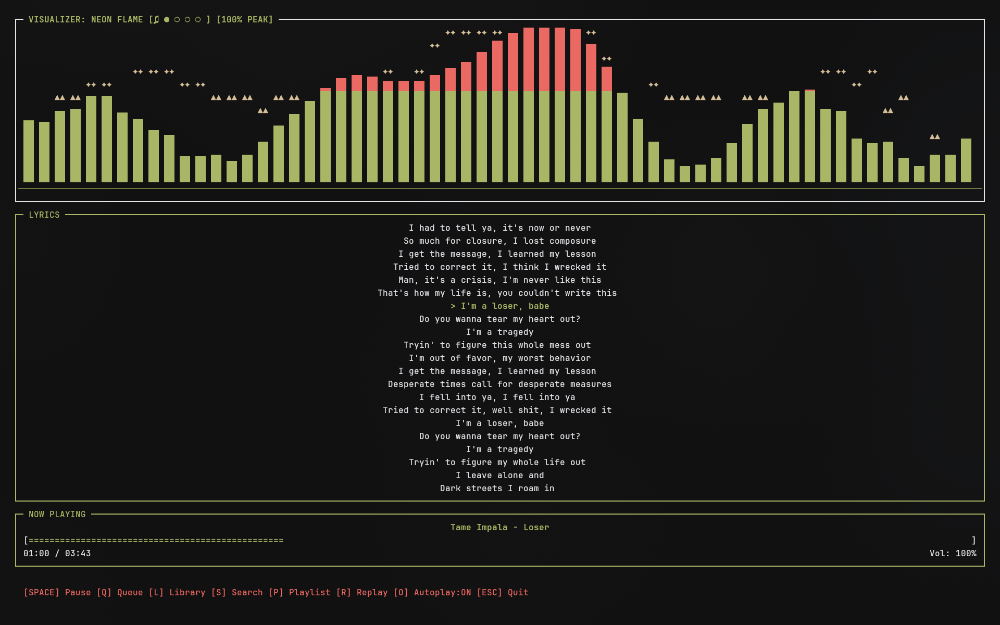
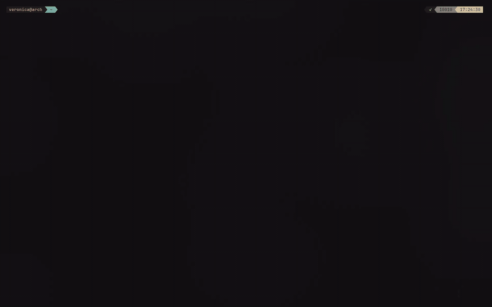

<div align="center">

<h4>Free, open-source terminal music player for Linux & macOS.</h4>

<hr>

<picture>
  
</picture>
<br><br>

<p align="center">
  <strong>The lightweight, aesthetic terminal music player built for people who live in the terminal.</strong><br>
  <em>Stream directly from YouTube, play lossless local albums, enjoy reactive visualizers, and follow synced lyrics — zero browser tabs needed.</em>
</p>

<p align="center">
  <a href="https://github.com/Swadesh-c0de/vibe-fi/releases/tag/v1.1.1"></a> <a href="LICENSE"></a>   <a href="https://github.com/Swadesh-c0de/vibe-fi/stargazers"></a> <a href="https://github.com/Swadesh-c0de/vibe-fi/pulls"></a>
</p>

<br><br>



</div>

---

## Demo

| Direct YouTube audio streaming, lossless local playback, reactive visualizers & synced lyrics |
| :-------------------------------------------------------------------------------------------: |
|  |

---

## Content

- [Demo](#demo)
- [Content](#content)
- [Why Vibe-Fi?](#why-vibe-fi)
- [Features](#features)
- [Comparison](#comparison)
- [Installation](#installation)
  - [Automated Script (Recommended)](#automated-script-recommended)
  - [GitHub Releases (v1.1.1)](#github-releases-v111)
  - [Building from Source](#building-from-source)
- [Usage & Workflow](#usage--workflow)
  - [CLI Commands & Search](#cli-commands--search)
  - [Window Manager Setup](#window-manager-setup)
- [Supported Systems](#supported-systems)
- [Hotkeys](#hotkeys)
  - [Global Navigation](#global-navigation)
  - [Playback Screen](#playback-screen)
  - [Library & Playlists](#library--playlists)
- [Themes & Visualizers](#themes--visualizers)
- [Configuration & Dotfiles](#configuration--dotfiles)
- [Architecture](#architecture)
- [Notes & Invariants](#notes--invariants)
- [Troubleshooting](#troubleshooting)
- [Contributing](#contributing)
- [Thanks](#thanks)
- [Keep Vibing](#d-_-b-turn-up-the-volume--keep-vibing)

---

## Why Vibe-Fi?

We've all been there:

You're completely locked in. Neovim is open, your terminal multiplexer is humming, code is flowing, and you just want some tunes in the background.

Your options usually kind of suck:

- **Open Spotify or a YouTube tab**: Say goodbye to 2 GB of RAM, listen to your laptop fans scream like a jet engine just to stream background audio, and break your keyboard flow every time you need to skip a track.
- **Use classic CLI players**: `cmus` and `mpd` are legendary, but setting up background daemons, configuring audio outputs, or wrestling shell scripts just to stream a YouTube track is a whole weekend project. And good luck getting live synced karaoke lyrics or aesthetic visualizers out of the box.

**Vibe-Fi** is built to bridge that gap.

Written in clean C++17, Vibe-Fi pairs the audio horsepower of `libmpv` with a lightweight, double-buffered `ncurses` interface. You get instant streaming via `yt-dlp`, local lossless folder crawling, real-time physics visualizers, live scrolling lyrics, native desktop media keys via MPRIS, and dotfile-friendly plaintext state — all in a single binary that starts in milliseconds and sips under 35 MB of RAM.

---

## Features

### Direct YouTube Streaming
Just type `vibe "song query"` or hit <kbd>S</kbd> inside the app. Audio streams resolve and pipe directly through `yt-dlp` into `libmpv`. Automatic stream recovery ensures smooth, uninterrupted playback even on unstable connections. No video decoding, no GPU drain, no browser tabs, no ads. You can also paste raw YouTube URLs on the fly (<kbd>U</kbd>) to stream live sets, mixes, or podcasts.

### Lossless Local Audio Crawler
Hit <kbd>L</kbd> to browse your local music collection. It handles `.flac`, `.mp3`, `.wav`, `.m4a`, `.ogg`, `.opus`, `.aac`, `.alac`, `.aiff`, and `.webm`. Song durations are cached in memory so folder hopping feels instant. Add any highlighted track to a playlist with <kbd>A</kbd>.

### Physics-Driven Audio Visualizers
Real-time audio telemetry extracted directly from FFmpeg's `@astats` filter — measuring RMS loudness, peak spikes, and zero-crossing pitch dynamics:
- **Cava Wave** *(Default)*: CAVA-style continuous fluid spectrum with Monstercat neighbor smoothing, parabolic gravity ballistics, and multi-tier dynamic theme gradients.
- **Neon Flame**: A dual-mirrored frequency volcano erupting from the center with floating peak gravity caps (`▔`) and real-time metronome tracking.
- **Stereo Bars**: Classic graphic equalizer with left/right channel separation and natural decay physics.

Cycle between them anytime with <kbd>V</kbd>.

### Synchronized LRC Lyrics
Automatic background lookups against `lrclib.net` matching the active track and artist. Lines highlight and smoothly auto-scroll in real time with the audio. Fetched lyrics are cached offline in `~/.vibe-fi/cache/lyrics/` so they work forever without internet. Want to read ahead? Just scroll manually with <kbd>↑</kbd> / <kbd>↓</kbd>.

### Desktop Media Keys & MPRIS
Native Linux D-Bus service (`org.mpris.MediaPlayer2`). Play, pause, and skip using your hardware keyboard keys, `playerctl`, Waybar, Polybar, or whatever desktop bar you're rocking.

### Discord Rich Presence
Show off what you're listening to on your Discord profile through raw Unix domain sockets (`discord-ipc-0`). No bloated Node.js tools, Electron daemons, or bridge scripts required.

### Dotfile-Friendly Playlists & State Memory
Create, rename, reorder, and move songs across playlists (<kbd>P</kbd>), or export any list to standard `.m3u` (<kbd>E</kbd>). Closed your terminal? Hit <kbd>R</kbd> at launch to restore your exact track position and volume from `~/.vibe-fi/state.ini`. Your active theme and visualizer modes are also remembered automatically across launches.

### Curated Color Themes
Press <kbd>T</kbd> to cycle between four themes crafted to look great in native terminal environments (your last used theme is saved and restored automatically on next launch):
- **Midnight**: Deep indigo borders, electric cyan spectrum, magenta highlights.
- **Matrix**: Phosphor green monochrome hacker aesthetic.
- **Nord**: Arctic cyan borders, clean frost-white levels, cool blue accents.
- **HyDE**: Velvet magenta borders, violet and lavender wave spectrum, vivid cyan highlights.

---

## Comparison

| Capability | Vibe-Fi | cmus | spotify-tui | ncmpcpp + mpd |
| :--- | :---: | :---: | :---: | :---: |
| **YouTube Streaming** | **Built-in (`yt-dlp`)** | ❌ No | ❌ No | ⚠️ Complex scripts |
| **Lossless Local Audio** | **Native C++17** | ✅ Yes | ❌ No | ✅ Yes |
| **Synchronized LRC Lyrics** | **Real-time (`lrclib`)** | ❌ No | ❌ No | ⚠️ External daemon |
| **Built-in DSP Visualizer** | **3 Modes (Physics & Wave)** | ❌ No | ❌ No | ⚠️ Requires Cava |
| **Zero-Config Setup** | **Single binary** | ✅ Yes | ❌ Spotify API / Premium | ❌ MPD config & server |
| **Linux MPRIS (`playerctl`)** | **Native D-Bus** | ⚠️ Plugin | ⚠️ Partial | ⚠️ Plugin |
| **Discord Rich Presence** | **Native Unix IPC** | ❌ No | ⚠️ Third-party | ⚠️ Third-party |
| **Memory Footprint** | **~25–35 MB** | ~15 MB | ~40 MB (+ Spotify client) | ~30 MB (+ MPD daemon) |

---

## Installation

### Automated Script (Recommended)

Got a minute? Grab the automated installer. It automatically detects your operating system, pulls all required native development libraries, compiles the binary with optimization flags, and installs `vibe`:

```bash
git clone https://github.com/Swadesh-c0de/vibe-fi.git
cd vibe-fi
chmod +x install.sh
./install.sh
```

If you want to inspect the script first, take a look: [install.sh](./install.sh)

> Supported distributions: **Arch Linux**, **Ubuntu / Debian**, **Fedora / RHEL**, **openSUSE**, and **macOS** (Homebrew).

---

### GitHub Releases (v1.1.1)

If you prefer downloading tagged release archives directly rather than cloning the main git branch, grab the release bundle from the [v1.1.1 Release Page](https://github.com/Swadesh-c0de/vibe-fi/releases/tag/v1.1.1):

```bash
# Download and extract the v1.1.1 release archive
curl -LO https://github.com/Swadesh-c0de/vibe-fi/archive/refs/tags/v1.1.1.tar.gz
tar -xzf v1.1.1.tar.gz
cd vibe-fi-1.1.1
chmod +x install.sh
./install.sh
```

---

### Building from Source

Prefer doing it manually with CMake? Here is the rundown:

#### 1. System Dependencies

<details>
<summary><b>Arch Linux / Manjaro</b></summary>

```bash
sudo pacman -S --needed base-devel cmake mpv ncurses yt-dlp ffmpeg dbus pkgconf
```
</details>

<details>
<summary><b>Ubuntu / Debian / Pop!_OS / Linux Mint</b></summary>

```bash
sudo apt update
sudo apt install -y build-essential cmake libmpv-dev libncurses-dev libdbus-1-dev mpv ffmpeg yt-dlp curl pkg-config
```
</details>

<details>
<summary><b>Fedora / RHEL</b></summary>

```bash
sudo dnf install -y gcc-c++ cmake mpv-devel ncurses-devel dbus-devel mpv ffmpeg yt-dlp curl pkgconf-pkg-config
```
</details>

<details>
<summary><b>openSUSE</b></summary>

```bash
sudo zypper install -y gcc-c++ cmake mpv-devel ncurses-devel dbus-1-devel mpv ffmpeg yt-dlp curl pkg-config
```
</details>

<details>
<summary><b>macOS (Homebrew)</b></summary>

```bash
brew install cmake mpv ncurses yt-dlp ffmpeg pkg-config
```
</details>

#### 2. Compile & Install

```bash
git clone https://github.com/Swadesh-c0de/vibe-fi.git
cd vibe-fi

# Configure release build
cmake -B build -DCMAKE_BUILD_TYPE=Release

# Build using all CPU threads
cmake --build build -j$(nproc 2>/dev/null || sysctl -n hw.ncpu 2>/dev/null || echo 2)

# Install for current user (no root required)
mkdir -p ~/.local/bin
install -m 755 ./build/vibe_fi ~/.local/bin/vibe
```

Make sure `~/.local/bin` is in your shell `$PATH`:
```bash
export PATH="$HOME/.local/bin:$PATH"
```

---

## Usage & Workflow

### CLI Commands & Search

Launch the interactive player or trigger audio straight from your terminal prompt:

```bash
# Launch interactive TUI player
vibe

# Search YouTube and play top match directly (fills queue with related tracks)
vibe "miles davis so what"
vibe "lofi hip hop radio"

# Stream direct audio from a YouTube link
vibe "https://www.youtube.com/watch?v=5qap5aO4i9A"

# Play a local audio file or album
vibe ~/Music/Daft_Punk/Random_Access_Memories.flac

# Flags
vibe --update      # Check for and install latest updates
vibe --uninstall   # Uninstall Vibe-Fi binaries and setup
vibe --no-update   # Skip automatic startup update check
vibe --version     # Display version information
vibe --help        # Display usage guide
```

### Window Manager Setup

If you run a tiling window manager (Hyprland, i3, Sway, or bspwm), map a keybinding to open Vibe-Fi in a dedicated floating scratchpad:

```ini
# Example for Hyprland (~/.config/hypr/hyprland.conf)
bind = $mainMod, M, exec, alacritty --class "music-player" -e vibe
windowrulev2 = float, class:^(music-player)$
windowrulev2 = size 1000 620, class:^(music-player)$
```

### Uninstallation

You can easily uninstall Vibe-Fi at any time using either method:

**From anywhere in your terminal:**
```bash
vibe --uninstall
```

**Or from the repository directory:**
```bash
./uninstall.sh
```

Both methods safely prompt for confirmation before deleting binaries, and ask whether you want to preserve or delete your playlists and configurations (`~/.vibe-fi`).

---

## Supported Systems

- [x] **Linux** (Arch, Ubuntu, Debian, Fedora, openSUSE, NixOS, Void, etc.)
  - Native D-Bus MPRIS media keys (`playerctl`, Waybar, Polybar)
  - Native Unix domain socket Discord Rich Presence
- [x] **macOS** (Homebrew audio pipeline, headless mpv)

---

## Hotkeys

> [!TIP]
> Vibe-Fi supports classic Vim navigation (<kbd>j</kbd> / <kbd>k</kbd> / <kbd>h</kbd>) as well as standard arrow keys across all menus and lists.

### Global Navigation

| Key | Action |
| :---: | :--- |
| <kbd>ESC</kbd> | Back / Dismiss modal / Exit |
| <kbd>↑</kbd> / <kbd>k</kbd> | Move selection up |
| <kbd>↓</kbd> / <kbd>j</kbd> | Move selection down |
| <kbd>ENTER</kbd> | Play track / Open directory / Confirm action |

### Playback Screen

| Key | Action |
| :---: | :--- |
| <kbd>SPACE</kbd> | Toggle Play / Pause |
| <kbd>N</kbd> / <kbd>></kbd> | Next track in queue |
| <kbd>B</kbd> / <kbd><</kbd> | Previous track in queue |
| <kbd>←</kbd> / <kbd>→</kbd> | Seek backward / forward 5 seconds |
| <kbd>+</kbd> / <kbd>-</kbd> | Volume Up / Down |
| <kbd>S</kbd> | Open YouTube search dialog |
| <kbd>L</kbd> | Open local music library |
| <kbd>P</kbd> | Browse custom playlists |
| <kbd>C</kbd> | View current play queue |
| <kbd>U</kbd> | Input direct YouTube URL to stream |
| <kbd>V</kbd> | Cycle visualizer (`Cava Wave` &rarr; `Neon Flame` &rarr; `Stereo Bars`) |
| <kbd>T</kbd> | Cycle theme (`Midnight` &rarr; `Matrix` &rarr; `Nord` &rarr; `HyDE`) |
| <kbd>O</kbd> | Toggle Autoplay (`ON` / `OFF`) |
| <kbd>R</kbd> | Replay track (or restore session from launch screen) |
| <kbd>Q</kbd> | Jump to active playlist or search result queue |
| <kbd>↑</kbd> / <kbd>↓</kbd> | Scroll synced lyrics manually |
| <kbd>ESC</kbd> | Quit (with confirmation prompt) |

### Library & Playlists

| View | Key | Action |
| :--- | :---: | :--- |
| **Library Browser** | <kbd>ENTER</kbd> | Play track / Open directory |
| | <kbd>BKSP</kbd> / <kbd>h</kbd> | Go up one directory |
| | <kbd>A</kbd> | Add highlighted track to playlist |
| **Playlists Overview** | <kbd>ENTER</kbd> | Inspect playlist tracks |
| | <kbd>N</kbd> | Create new playlist |
| | <kbd>R</kbd> | Rename playlist |
| | <kbd>D</kbd> | Delete playlist |
| | <kbd>E</kbd> | Export playlist to `.m3u` file |
| **Playlist Editor** | <kbd>ENTER</kbd> | Play track immediately |
| | <kbd>D</kbd> | Remove track from playlist |
| | <kbd>M</kbd> | Move track to another playlist |
| **Play Queue** | <kbd>ENTER</kbd> | Jump to track in queue |
| | <kbd>D</kbd> | Remove track from queue |

---

## Themes & Visualizers

### Color Themes (<kbd>T</kbd>)

| Theme | Border & Accents | Visualizer Spectrum | Progress Bar |
| :--- | :---: | :---: | :---: |
| **Midnight** *(Default)* | Deep Indigo | Electric Cyan | Magenta |
| **Matrix** | Terminal Green | Phosphor Green | Bright Green |
| **Nord** | Arctic Cyan | Clean Frost White | Cool Blue |
| **HyDE** | Velvet Magenta | Violet & Lavender Wave | Vivid Cyan |

### Visualizers (<kbd>V</kbd>)

1. **Cava Wave** *(Default)*: CAVA-style continuous fluid spectrum with Monstercat neighbor smoothing, parabolic gravity ballistics, and multi-tier dynamic theme gradients.
2. **Neon Flame**: Center-erupting frequency volcano with dancing columns, floating gravity peak caps (`▔`), and rhythmic metronome tracking.
3. **Stereo Bars**: Classic graphic equalizer with left/right channel balance.

---

## Configuration & Dotfiles

No hidden binary databases or opaque files. Everything is kept readable and version-controllable under `~/.vibe-fi/`:

```
~/.vibe-fi/
├── state.ini                   # Saved session: track URL, seek pos, volume, playlist, active theme
├── playlists/                  # Plaintext playlist files (Title|URL|Duration)
│   ├── Chill.txt
│   ├── Synthwave.txt
│   └── Favorites.txt
└── cache/
    └── lyrics/                 # Cached JSON and LRC responses from lrclib.net
        └── Daft+Punk_Get+Lucky.json
```

Because playlists are saved as clean, line-delimited `Title|URL|Duration` text files, you can easily track them in your dotfiles git repository, share them with friends, or edit them with `nvim` and `sed`.

---

## Architecture

Vibe-Fi is built with decoupled, modular domains:

```
                            +--------------------+
                            |      main.cpp      |
                            |  (CLI Bootstrap)   |
                            +---------+----------+
                                       |
                   +-------------------+-------------------+
                   |                                       |
         +---------v---------+                   +---------v---------+
         |     src/ui/       |                   |    src/core/      |
         |   UI (ncurses)    |                   |  Player (libmpv)  |
         +---------+---------+                   +---------+---------+
                   |                                       |
       +-----------+-----------+                           |
       |                       |                           |
+------v------+       +--------v--------+         +--------v--------+
|    Views    |       |   Visualizer    |<--------+ Audio Analysis  |
|  (Playback, |       | (Physics Engine)|         | (@astats filter)|
| Library, etc|       +-----------------+         +-----------------+
+------+------+
       |
+------v-----------------------------------------------------+
|                       src/services/                        |
|  - Library: Non-blocking crawler & in-memory cache         |
|  - Lyrics: REST lrclib.net client & disk cache             |
|  - PlaylistManager: Plaintext CRUD (.txt) & M3U exporter   |
|  - Search: Parameterized yt-dlp query pipeline             |
+------------------------------------------------------------+
       |
+------v-----------------------------------------------------+
|                     src/integrations/                      |
|  - MPRIS: Thread-safe D-Bus loop for Linux media keys      |
|  - Discord RPC: Native Unix domain socket IPC daemon       |
+------------------------------------------------------------+
```

---

## Notes & Invariants

If you're hacking on the codebase or planning to submit a PR, keep these in mind:

- **Decimal Locale Requirement**: `libmpv` relies internally on `strtod` for decimal timestamp parsing. We enforce `LC_NUMERIC="C"` across all locales so European decimal commas don't cause crashes or seek errors.
- **Node Memory Cleanup**: Audio analysis nodes are cleanly released on every single frame via `mpv_free_node_contents` to prevent memory leaks during long playback sessions.
- **Double Buffering**: Terminal rendering uses `werase` and `wnoutrefresh` across all sub-windows, executing a single `doupdate` per frame (30 FPS) to eliminate curses flicker.

---

## Troubleshooting

<details>
<summary><b>1. YouTube streaming errors or 403 Forbidden</b></summary>
<br>

YouTube frequently updates its stream decipher signatures. Updating `yt-dlp` to the latest release fixes this 99% of the time:

```bash
# Arch Linux
sudo pacman -Syu yt-dlp

# Ubuntu / Debian
sudo yt-dlp -U 2>/dev/null || sudo curl -L https://github.com/yt-dlp/yt-dlp/releases/latest/download/yt-dlp -o /usr/local/bin/yt-dlp && sudo chmod a+rx /usr/local/bin/yt-dlp

# Check version
yt-dlp --version
```
</details>

<details>
<summary><b>2. Media keys not responding</b></summary>
<br>

Verify that the MPRIS D-Bus interface is registered on your session bus:

```bash
playerctl -l
# Expected output: vibe_fi

# Test manual trigger:
playerctl --player=vibe_fi play-pause
playerctl --player=vibe_fi next
```
Ensure `libdbus-1-dev` was installed when building on Linux.
</details>

<details>
<summary><b>3. Discord Rich Presence not displaying</b></summary>
<br>

1. Ensure the Discord desktop client is open and running.
2. In Discord Settings: **Activity Privacy** &rarr; turn ON **"Display current activity as a status message"**.
3. Verify `$XDG_RUNTIME_DIR` is set in your shell session (`echo $XDG_RUNTIME_DIR`). Vibe-Fi communicates with `discord-ipc-0` inside this directory.
</details>

<details>
<summary><b>4. Misaligned borders or visualizer blocks</b></summary>
<br>

Make sure your terminal has UTF-8 enabled and uses a font with proper box-drawing character glyphs (like *JetBrains Mono*, *Fira Code*, *Hack*, or *Geist Mono*):

```bash
export LANG=en_US.UTF-8
export LC_ALL=en_US.UTF-8
export TERM=xterm-256color
```
</details>

---

## Contributing

If you'd like to contribute, please check our **[Contributing Guide](./CONTRIBUTING.md)** for architecture invariants, visualizer playbooks, and pull request guidelines.

Got ideas for a new visualizer mode, extra stream resolvers, or UI polish? Issues and pull requests are warmly welcomed!

---

## Thanks

### Support

- If Vibe-Fi saves your laptop fans or adds some style to your rice, drop a star! ⭐
- Share it with your fellow Linux ricers & terminal dwellers.

### Maintainer

> PRs and issues are always open. Feel free to jump in!

- **[@Swadesh-c0de](https://github.com/Swadesh-c0de)** - Creator and maintainer

---

<div align="center">

## d[-_-]b Turn up the volume & keep vibing.

</div>
